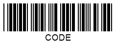
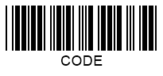
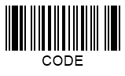
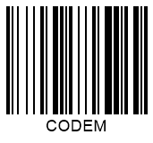
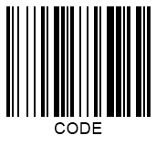

## **Overview**
The idea of using *checksum* (or *check digit*) as an error identification mechanism has been proposed to check for the integrity and accuracy of data encoded in 1D barcodes. A checksum digit can be used to assure that barcode information has not been lost or damaged and guarantee accurate barcode recognition. Generally, a checksum is the last symbol in a barcode sequence encoded as a character. 1D barcodes may include an optional or obligatory checksum digit calculated based on a special algorithm. Barcode scanner decoders perform checksum controls through mathematical operations based on barcode digits preceding the checksum character and then compare the calculation result with the checksum value.  
  
Barcodes without obligatory checksum verification comprise self-checking characters. Such barcodes are inherently resistant to errors as any character alteration is viewed as erroneous. Two inconsistent modifications performed in a barcode digit and a scan line simultaneously may lead to inappropriate barcode recognition. This is called substitution error and can be mitigated by using checksum controls.
 
## **Checksum Definition**
Most 1D barcode types have been created in the 70s. For many of them, checksum controls are identified in a simple way: as a sum of all preceding digits modulo the index of the maximum encoded character. As further development, barcode standards introduced at the beginning of the 2000s use more sophisticated checksum verification algorithms.  
  
In general, enabling checksum in ***Aspose.BarCode for Cloud*** for 1D barcodes allows verifying barcodes with minor damages. However, in the case of significantly damaged barcode images, the probability of inaccurate recognition increases.  
  
## **Checksum Settings**
Different types use particular checksum controls (optional or obligatory) and different checksum calculation algorithms. When checksum controls are obligatory, ***Aspose.BarCode for Cloud*** utilizes the most common algorithm for that symbology. When needed, the checksum character is added as the last barcode character. The *EnableChecksum* enum is intended for checksum calculation in 1D barcodes. It is set to *Yes* for the types with obligatory checksum controls and *No* for those with an optional check digit by default.  
  
Barcode standards with optional and obligatory checksum settings are listed below.
  
|Checksum Controls|1D Barcode Types|
|---|---|
|**Optional**|Codabar, Code 39, Italian Post 25, Interleaved 2-of-5, Matrix 2-of-5, MSI, Pharmacode, PatchCode, PZN, Standard 2-of-5|
|**Obligatory**|Codablock-F, Code 11, Code 128, Code-16K, Code 32, Code 93, DataBar Expanded Stacked, DataBar Expanded, DataBar Omnidirectional, DataBar Stacked Omnidirectional, DataBar Stacked, DataBar Limited, DataBar Truncated, EAN-13, EAN-14, EAN-2, EAN-5, EAN-8, GS1 Codablock-F, GS1 Code 128, IATA 2-of-5, ISBN, ISMN, ISSN, ITF-14, ITF-6, OPC, SSCC-14, SSCC-18, UPC-A, UPC-E, UpcaGs1DatabarCoupon, VIN|

### **Optional Checksum Controls**
Linear barcode types with optional checksum controls do not require check digit calculation by default. For such barcode types, the *EnableChecksum* enum provides the following options:
- **public static final EnableChecksum DEFAULT** and **public static final EnableChecksum NO**. Checksum control is not enabled.
- **public static final EnableChecksum YES**. The checksum algorithm of the most appropriate type for the given symbology is used.
  
|Checksum Controls|Checksum Enabled|Checksum Disabled|
| :-: | :-: | :-: |
| |||
    
### **Obligatory Checksum Controls**
For barcode types with obligatory checksum controls, objects of *EnableChecksum* can be initialized as follows:
- **public static final EnableChecksum DEFAULT** and **public static final EnableChecksum YES**. Checksum calculation is performed according to the specific algorithm.
- **public static final EnableChecksum NO**. 

The following barcode image has been generated with obligatory checksum enabled.   

    
## **Displaying Checksum for Code 128**
For *Code 128* and *GS1 Code 128*, ***Aspose.BarCode for Cloud*** allows developers to use a specific method called *setChecksumAlwaysShow* of class *BarcodeParameters*. In this case, the checksum digit is displayed in the *CodeText* field as human-readable barcode text. 
  
|Checksum Visibility|Displayed|Hidden|
| :-: | :-: | :-: |
| |||
  
