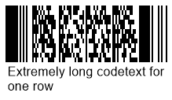
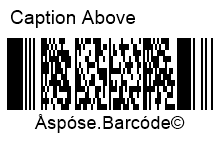
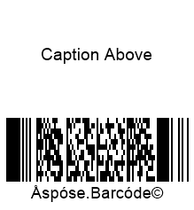

This article describes how to work with text placed on barcode images. ***Aspose.BarCode for Cloud*** enables customizing various parameters of barcode text: visibility, font, spacings, text location, and wrapping modes.

## **Overview**
***Aspose.BarCode for Cloud*** allows developers to add human-readable text on barcode images in three different forms shown in the scheme below: main text label, top caption, and bottom caption. Any of these elements can be placed optionally or hidden.
    

   
## **Barcode Text**
The main barcode text label contains short text information detached from bars by spacings. This text label can take six positions, as explained in the figure below: top center, top left, top right, bottom center, bottom left, or bottom right.
  

   
### **Text Visibility**
***Aspose.BarCode for Cloud*** allows developers to visualize or hide barcode text. If there is no need to put human-readable text on a barcode image, barcode images can be generated without text labels, as shown in the example below.
  

  
     
### **Text Positioning**
The position of a barcode text label can be modified by customizing two parameters: alignment and location. These parameters can be adjusted through *setLocation* and *setAlignment* methods of class *CodetextParameters*.
  
#### **Location**
  
The *setLocation* method allows setting the vertical position of a text label, namely, placing it above or below bars, as shown in the figures below. The default setting is *Below*. 
  
|Text Location|Above Barcode|Below Barcode|
| :-: | :-: | :-: |
| |||
      
#### **Alignment**
The *setAlignment* method is used to set the horizontal position of a text label in a barcode image: right-side, left-side, or center, as illustrated in the figures below. The default setting of barcode text alignment is *Center*. 
  
|Text Alignment|Left|Center|Right|
| :-: | :-: | :-: | :-: |
| ||||
    
### **Spacing between Bars and Text Label**
The default spacing (gap) between bars and a text label is equal to 2pt. It is possible to modify this spacing using the *setSpace* method of class *CodetextParameters*. This method is not applicable to several barcode types, including EAN 13, EAN 8, UPC-E, UPC-A, ISMN, ISBN, ISSN, and UpcaGs1DatabarCoupon.  
  
Sample barcode images shown below have been created with various spacing settings (five and forty pixels).
  
|Text Spacing|Is Set to 5 Pixels|Is Set to 40 Pixels|
| :-: | :-: | :-: |
| |||
  
 
### **Font Settings**
To manage barcode text font, ***Aspose.BarCode for Cloud*** provides *setFont* and *setFontMode* methods of class *CodetextParameters*. The default font setting is Arial 5pt regular. This setting is ignored if the *Auto* mode is enabled using the *setFontMode* method. This method is used to manage font size settings automatically. If it is called passing the *Auto* value, font size is determined automatically based on *xDimension* in such a way that the text label should take only one text line. *FontMode.AUTO* is recommended when *AutoSizeMode.NEAREST* or *AutoSizeMode.INTERPOLATION* settings are enabled. Alternatilvely, setting *FontMode.MANUAL* allows managing font size manually. Other font parameters, including font style, are set similarly in both *Auto* and *Manual* modes.  
  
Barcode images shown below have been created with these two font modes. 
    
|Font Setting Mode|Auto|Manual|
| :-: | :-: | :-: |
| |||
  

### **NoWrap Mode for Text**
It is possible to avoid line breaks in a text that is too long for a single row using the *setNoWrap* method of class *CodetextParameters*. When the *True* setting is enabled, the text label is displayed in a single row regardless of the text length. The default setting is *False*. Barcode images shown below have been created with different *NoWrap* settings.

|Text Wrapping Mode|Wrap|No Wrap|
| :-: | :-: | :-: |
| |||
  
  
## **Replacing Barcode Text in 2D Barcodes**
To replace barcode text in 2D barcodes with some other text label with improved readability without modifications to the barcode image itself, it is possible to call the *setTwoDDisplayText* method of class *CodetextParameters* and pass new text to be placed. This is applicable to selected 2D symbologies, including QR Code, Aztec Code, Data Matrix, MaxiCode, PDF417, and DotCode.  
  
The sample barcode image shown below has been created using the *TwoDDisplayText* setting.
  

  
## **Caption**  
***Aspose.BarCode for Cloud*** allows developers to place additional text labels in a barcode image in form of captions above and below barcodes. As demonstrated in the figure below, such text captions have a parameter called *Padding* that allows modifying spacing size between captions and the nearest element (barcodes, main text label, or borders). Both text captions are disabled by default. If required, they can be shown by one or both simultaneously.
     

  
### **Caption Visibility**

As stated above, additional text captions *CaptionAbove* and *CaptionBelow* are disabled by default. When required, top and bottom caption labels can be shown independently from each other or enabled simultaneously. The *setVisible* method of class *CaptionParameters* can be used to display one or two captions. Then, caption text can be inserted through the *setText* method. If required, caption labels can replace main text in 1D barcodes by enabling the former and disabling the latter. The figures given below demonstrate how to caption positioning options.
  
|Caption Visibility|Above|Below|
| :-: | :-: | :-: |
| |||
     
### **Text Positioning**
The *setAlignment* method of class *CaptionParameters* allows modifying horizontal positions of caption labels in three directions: right, left, and center. The default position of captions is center. The figures shown below demonstrate barcode images with the top caption label with different alignment positions.
  
|Caption Alignment|Left|Center|Right|
| :-: | :-: | :-: | :-: |
| ||||

### **Caption Padding**
The *setPadding* method of class *CaptionParameters* can be used to manage spacings for text captions. By default, the spacing value is set to {5pt; 5pt; 0; 5pt} for the top caption and {0; 5pt; 5pt; 5pt} for the bottom one according to the standard Rectangle setting {Top, Left, Bottom, Right}. This method is inapplicable when captions are disabled. Barcode images shown below have been generated with different padding settings.
  
|Caption Padding|Is Set to 5 Pixels|Is Set to 40 Pixels|
| :-: | :-: | :-: |
| |||
  

### **Caption Font**
***Aspose.BarCode for Cloud*** does not enable automatic font size settings based on barcode size. Accordingly, caption font size requires manual setting. For top and bottom captions, various parameters, including font style and size can be set independently. Caption font can be customized through special methods of class *FontUnit*. The default setting for caption font is Arial 8pt regular. 
The barcode image shown below explains different caption font settings.
   

  
### **NoWrap Mode for Caption**

The *setNoWrap* method of class *CaptionParameters* allows disabling text line breaks when a text string is too large to fit in one line. When this method is called passing the *True* value, caption text is always displayed as a single line. Barcode images below show the difference between *setNoWrap.TRUE* and *setNoWrap.FALSE* settings.
  
|Caption Wrapping|Is Set to *Wrap*|Is Set to *No Wrap*|
| :-: | :-: | :-: |
| |||
  
