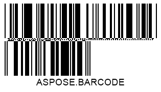

{}[Read Barcodes Online](https://products.aspose.app/barcode/recognize): You can test the quality of ***Aspose.BarCode*** recognition functionality and view the results online.{}
  
## **Overview**
***Aspose.BarCode for Cloud*** not only enables reading information encoded in a barcode but also provides a possibility to analyze its technical properties, including symbology, orientation angle, position, and metadata. This data is stored in objects of class *BarCodeResult* and can be fetched using special methods described further in this article.  

## **Barcode Type and Encoded Data**
To obtain input barcode data and its symbology, *getCodeText* and *getCodeType* methods of class *BarCodeResult* can be used. The other method called *getCodeTypeName* returns the text name of the barcode type.
  

 
  
## **Reading Barcode Data as Byte Stream**
It is possible to load barcode data as a byte stream using a special method of class *BarCodeResult* that is called *getCodeBytes*. 

## **Decoding Barcode Text in Unicode**
For barcodes in which the barcode data is encoded in a Unicode encoding, the library provides the *getCodeText* method that can be used to enable the required encoding in the following format: getCodeText(java.nio.charset.Charset encoding).  
  

   
## **Quality Check of Recognition Results**
Developers may need to check whether barcode reading outputs are accurate and complete. For this purpose, ***Aspose.BarCode for Cloud*** provides two specific methods of class *BarCodeResult*: *getConfidence* and *getReadingQuality*.  
Depending of the quality of barcode reading results, the *getConfidence* method returns a instance of the *BarCodeConfidence* enum that denotes the recognition confidence level. This enumeration contains values *STRONG*, *NONE*, and *MODERATE* that are discussed below. The *getReadingQuality* method returns an estimate of recognition quality corresponding to the confidence level, as explained in the table below.
  
|Confidence Level|Quality Value|Description|
|---|---|---|
|*NONE*|0|If the confidence level is *None*, it indicates that the barcode is invalid and its information has been read with errors. If required, it is possible to get its symbology and position in the image and decode barcode information partially|
|*MODERATE*|80|This confidence level may be returned for linear and postal barcode types with weak or absent checksum controls. Furthermore, it is necessary to analyze the result of the *getReadingQuality* method. The absolute correctness of barcode reading results is not assured|
|*STRONG*|100|This confidence level is returned for all 2D symbologies with Reed-Solomon error correction. It means that barcode text has been recognized accurately|

    
## **Barcode Position and Orientation Angle**
To obtain the position of a source barcode and its orientation angle, methods class *BarCodeRegionParameters* can be used. This class allows getting the information about the barcode region in the following forms:
-	Quadrangle – a quadrangle object that bounds a barcode
-	Rectangle - a rectangle object that bounds a barcode
-	Points – an array of points constituting a barcode
-	Angle – an orientation angle in degrees
    

## **Barcode Metadata**

### **Reading Macro PDF417 and Macro PDF417 Metadata**

Metadata from *PDF417* barcodes can be obtained using methods of class *Pdf417ExtendedParameters* that are listed below.
  
|PDF417 Metadata Method|Description|
|---|---|
|*getPdf417MacroFileID*|Gets the unique identifier of a barcode series or a PDF417 file|
|*getPdf417MacroSegmentID*|Gets the current identifier of a segment|
|*getPdf417MacroSegmentsCount*|Returns the number of barcodes in a series|
|*getPdf417MacroFileName*|Returns the name of a file|
|*getPdf417MacroChecksum*|Gets the checksum value computed using CCITT-16 polynomial|
|*getPdf417MacroFileSize*|Returs the total size of bytes in a series|
|*getPdf417MacroTimeStamp*|Returns the time spent to generate/send the file|
|*getPdf417MacroAddressee*|Gets the address of the file sender|
|*getPdf417MacroSender*|Returns the name of the file sender|
  
  

  

### **Reading Metadata from QR Codes with Structured Append**
To fetch metadata from *QR Code* barcodes with structured append, ***Aspose.BarCode for Cloud*** provides a special class called *QRExtendedParameters*. Methods of this class enable reading the information from structured append that is used to combine several *QR Code* barcode into one. This data can be obtained using the following methods:

- *getQRStructuredAppendModeBarCodeIndex* - returns the sequence number of the current barcode (starting from 0)
- *getQRStructuredAppendModeBarCodesQuantity* - returns the number of barcodes in a composite *QR Code* barcode taht can take values from 2 to 16
- *getQRStructuredAppendModeParityData* - returns the checksum identifier byte that is usually computed as *XOR* of all bytes in which UTF16BE characters are encoded in two bytes  
  

  
### **Reading Metadata from DataBar Barcodes with 2D Components**
Metadata from *DataBar* barcodes with 2D components can be obtained using class called *DataBarExtendedParameters* that provides a special method called *is2DCompositeComponent*. This methods allows enabling or disabling a 2D component in *DataBar* barcodes.  
  

### **Reading Metadata from 1D Barcodes**
Some 1D barcode types, i.e. *EAN 13*, allow separating barcode input information itself from the checksum value. To do this, class *OneDExtendedParameters* provides the *getValue* method that allows getting 1D barcode text and the *getCheckSum* method that returns the result of checksum computation.
  
 

  
### **Getting Raw Data from Code 128 Barcodes**
Input data stored in *Code 128* barcodes can be encoded in three ways: A, B, or C. Class *Code128ExtendedParameters* provides a special method called *getCode128DataPortions* that returns decoded parts of barcode input information and the encoding mode.

