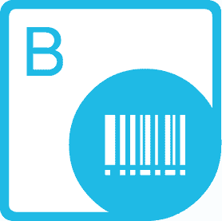
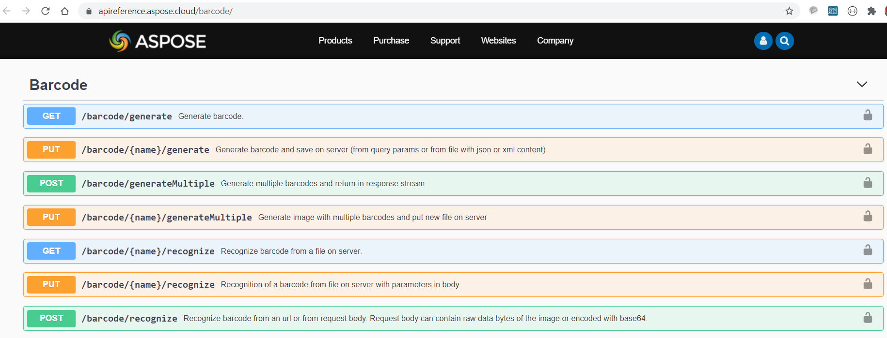

{} 

Aspose.BarCode Cloud is a REST API for Linear, 2D and postal barcode generation and recognition in the cloud. Recognize barcode images and generate barcode images in a variety of image formats: JPEG, PNG, GIF, BMP, TIFF, EMF, WMF, EXIF and ICON. Aspose.BarCode for Cloud REST API allows controlling all aspects of the image and text when generating barcode images. Developers can specify image width, height, border style and output image format. Also set barcode attributes like font style, font color, background color, barcode type and the barcode text location.
Our Aspose.BarCode for Cloud REST API comes with many features crucial to organizations, such as:

- Generate barcode images and save to stream or image file
- Recognize barcodes from stream or image file
- Enhance your application workflow by adding barcode functionality
- Embed barcodes in documents to aid traceability
- Use the recognition functions to drive your real-life work processes
- Specify barcode image settings
- Set barcode text attributes

{} 
### **API Description**
Aspose.BarCode Cloud is delivered over HTTP as a REST API with responses delivered in [JSON or XML format](https://docs.aspose.cloud/total/request-format/). Our API has predictable, resource-oriented URLs, and uses HTTP response codes to indicate API errors. You can see our API detail [here](https://apireference.aspose.cloud/barcode/).
### **Security and Authentication**
The Aspose.BarCode for Cloud API are secured and required authentication. Developers can [create](https://docs.aspose.cloud/total/create-new-app-and-get-app-key-and-sid/) app access key ID (appSID) and app secret access key when they [register](https://docs.aspose.cloud/total/creating-and-managing-account/). Authenticated requests require an signature and appSID query parameters. Signature is computed by encrypt the request URI using HMAC\_SHA1 with app secret key. You can see complete detail [here](https://docs.aspose.cloud/total/request-format/).
### **SDKs**
The API is completely independent of your operating system, database system or development language. We provide and support API SDKs in many development languages in order to make it even easier to integrate. You can see our available SDKs list here.
### **API Explorer**

](https://apireference.aspose.cloud/barcode/)

The easiest way to try out our API right away in your browser! With the [Aspose.Barcode Cloud API Reference](https://apireference.aspose.cloud/barcode/). This is a collection of Swagger documentation for the Aspose Cloud APIs. You can get information about all the resources in the API. It also provides testing and interactivity to our API endpoint documentation.
